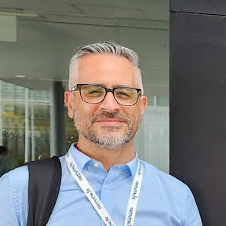

::: {.content-visible when-profile="english"}

<h1>Luciano Vidal</h1>

{width=250} \
\
Dirección de Productos de Modelación Ambiental y de Sensores Remotos \
Dirección Nacional de Ciencia e Innovación en Productos y Servicios \
Servicio Meteorológico Nacional \
Av. Dorrego 4019 - Ciudad Autónoma de Buenos Aires \

[</i>](https://x.com/LuchoVidalOK)
[</i>](https://scholar.google.com/citations?hl=es&user=PYbRmVIAAAAJ&view_op=list_works&sortby=pubdate) \

<i class="bi bi-inbox"></i>: lvidal@smn.gob.ar \

<h2>Bio</h2>

During my PhD I carried out a characterization of mesoscale convective systems with extreme properties that develop in the southeastern region of South America (SESA), advancing in the understanding of their life cycles and initiation areas. Since 2014 I am a researcher of scientific application oriented in remote sensing products at the National Meteorological Service of Argentina. I have extensive experience in the management and analysis of data provided by remote sensors such as weather radars and meteorological satellites for severe weather monitoring and forecasting. This includes implementing technological developments and intervening in the transfer of knowledge on remote sensing issues, as well as documenting and advising on related topics.

<h5>Education</h5>
MSci. Atmospheric Sciences (FCEN–UBA) \ 
PhD. in Atmospheric Sciences (FCEN–UBA) \ 

:::

::: {.content-visible when-profile="spanish"}

<h1>Luciano Vidal</h1>

{width=250} \
\
Dirección de Productos de Modelación Ambiental y de Sensores Remotos \
Dirección Nacional de Ciencia e Innovación en Productos y Servicios \
Servicio Meteorológico Nacional \
Av. Dorrego 4019 - Ciudad Autónoma de Buenos Aires \

[</i>](https://x.com/LuchoVidalOK)
[</i>](https://scholar.google.com/citations?hl=es&user=PYbRmVIAAAAJ&view_op=list_works&sortby=pubdate) \

<i class="bi bi-inbox"></i>: lvidal@smn.gob.ar \

<h2>Bio</h2>

During my PhD I carried out a characterization of mesoscale convective systems with extreme properties that develop in the southeastern region of South America (SESA), advancing in the understanding of their life cycles and initiation areas. Since 2014 I am a researcher of scientific application oriented in remote sensing products at the National Meteorological Service of Argentina. I have extensive experience in the management and analysis of data provided by remote sensors such as weather radars and meteorological satellites for severe weather monitoring and forecasting. This includes implementing technological developments and intervening in the transfer of knowledge on remote sensing issues, as well as documenting and advising on related topics.

<h5>Education</h5>
MSci. Atmospheric Sciences (FCEN–UBA) \
PhD. in Atmospheric Sciences (FCEN–UBA) \

:::

